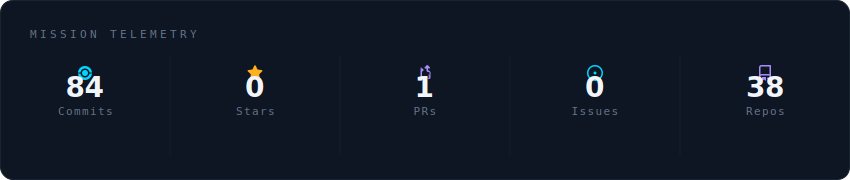

<!-- Galaxy Profile README — Pedro Bahry (Bahryz)
     SVGs are auto-generated by the GitHub Actions workflow every 12h. -->

  

 

  

 

  

 

  

 

<strong>More about me</strong>

 

Building robust solutions with Clean Architecture and MVC.
Bridging mobile development and infrastructure — Flutter to DevOps.

**Currently at** Banco Bari — SysOps Intern, Brazil

 

  
  

